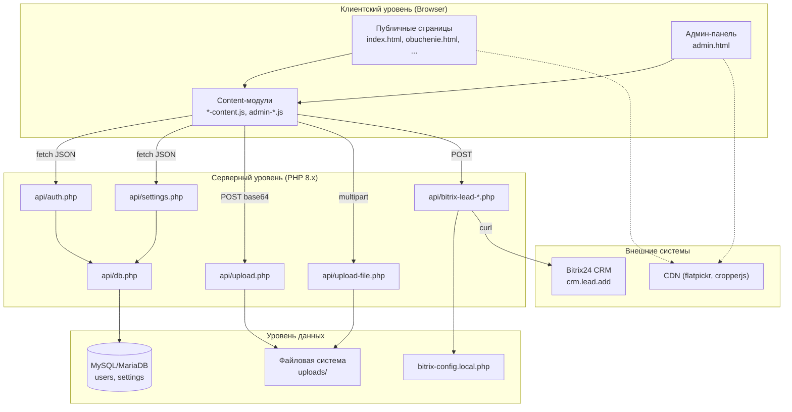
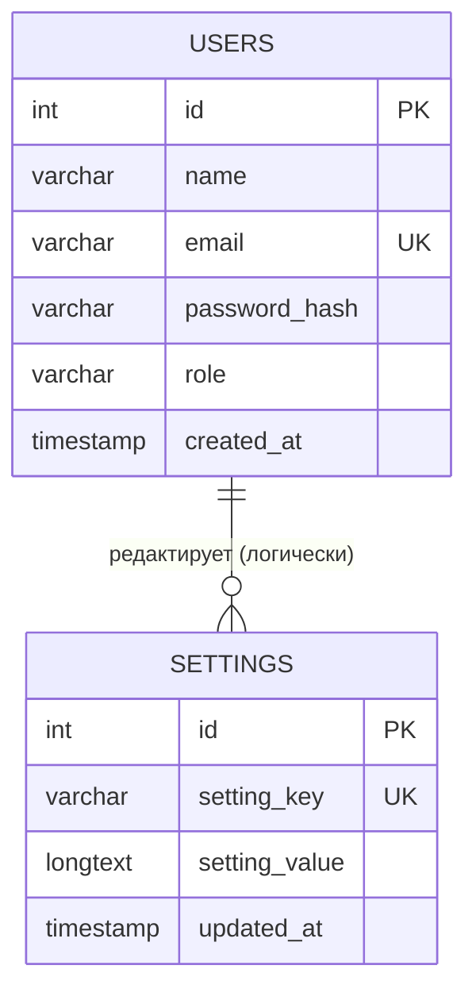
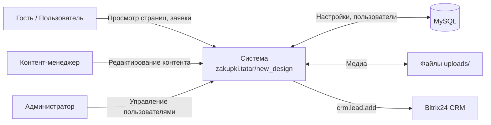
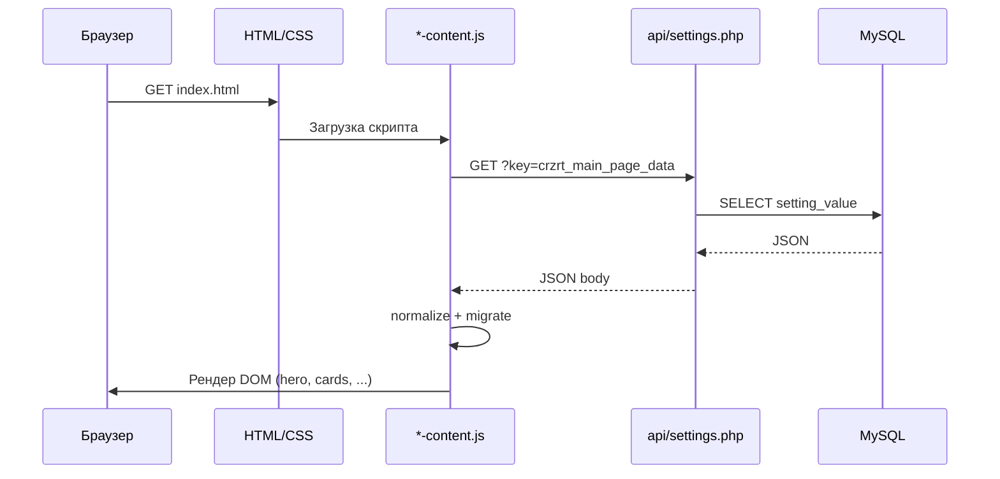
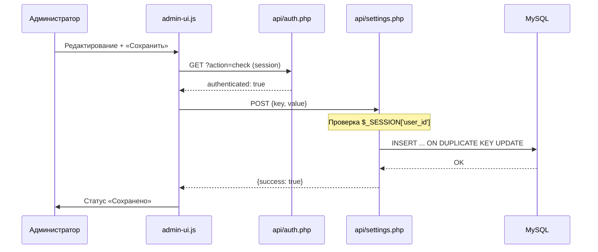
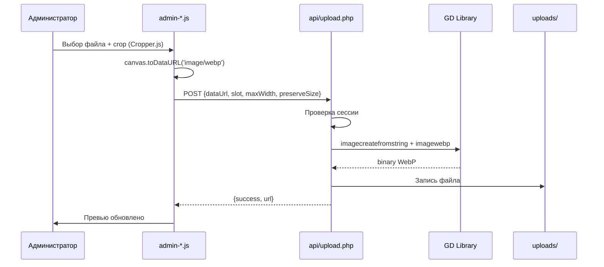
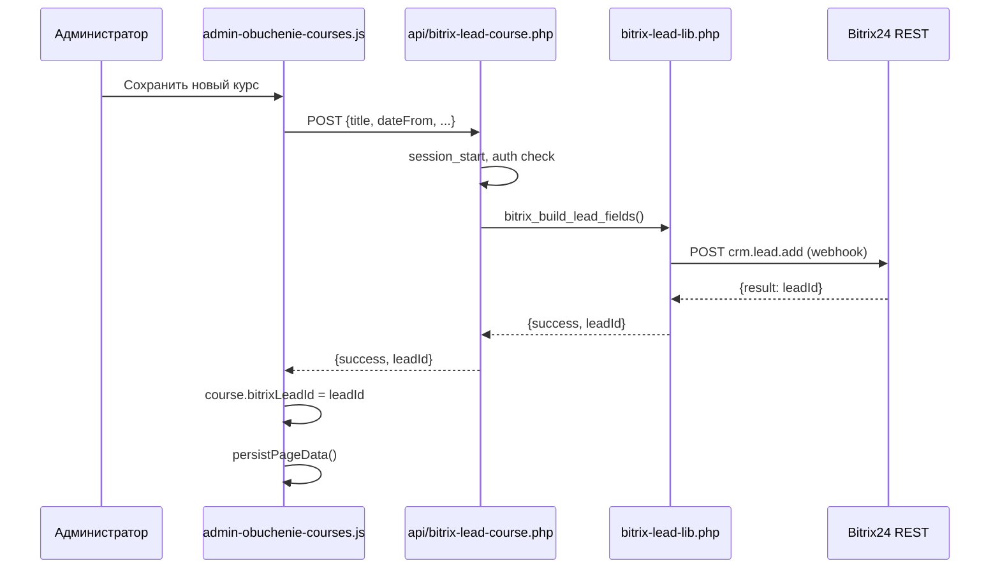
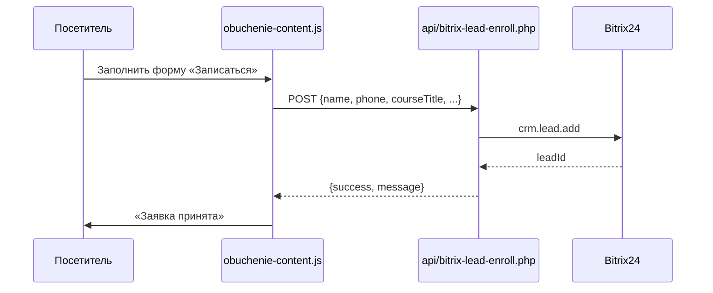

# ТЕХНИЧЕСКИЙ ПРОЕКТ (TECHNICAL DESIGN DOCUMENT)

## Веб-сайт АО «Центр развития закупок Республики Татарстан»

**Адрес размещения:** https://zakupki.tatar/new_design/  
**Версия документа:** 1.0  
**Дата:** 03.07.2026  
**Основание:** Техническое задание (Приложение № 1 к Договору), раздел 7.1.1  

---

## ЛИСТ СОГЛАСОВАНИЯ

| Роль | ФИО | Подпись | Дата |
|------|-----|---------|------|
| Заказчик | | | |
| Исполнитель | | | |
| Ответственный за ИБ | | | |

---

## СОДЕРЖАНИЕ

1. [Введение](#1-введение)
2. [Общие сведения о системе](#2-общие-сведения-о-системе)
3. [Архитектура системы](#3-архитектура-системы)
4. [Технологический стек](#4-технологический-стек)
5. [Структура программного комплекса](#5-структура-программного-комплекса)
6. [Модель данных и структура базы данных](#6-модель-данных-и-структура-базы-данных)
7. [Хранение контента и конфигурации](#7-хранение-контента-и-конфигурации)
8. [Диаграммы потоков данных](#8-диаграммы-потоков-данных)
9. [Подсистема аутентификации и авторизации](#9-подсистема-аутентификации-и-авторизации)
10. [Подсистема управления медиа-контентом](#10-подсистема-управления-медиа-контентом)
11. [Интеграция с Bitrix24 CRM](#11-интеграция-с-bitrix24-crm)
12. [Требования к безопасности (реализация)](#12-требования-к-безопасности-реализация)
13. [Производительность и кэширование](#13-производительность-и-кэширование)
14. [Развёртывание и эксплуатация](#14-развёртывание-и-эксплуатация)
15. [Приложения](#15-приложения)

---

## 1. ВВЕДЕНИЕ

### 1.1. Назначение документа

Настоящий Технический проект (далее — **ТП**, **TDD**) разработан в соответствии с требованиями пункта 7.1.1 Технического задания на техническую реализацию веб-сайта АО «Центр развития закупок РТ» и предназначен для формализованного описания архитектурных решений, структуры хранения данных, взаимодействия компонентов и потоков информации в рамках программно-аппаратного комплекса «Веб-сайт АО «Центр развития закупок Республики Татарстан»».

Документ адресован специалистам Заказчика, ответственным за эксплуатацию, сопровождение и развитие информационного ресурса, а также служит основанием для приёмо-сдаточных испытаний и передачи системы в опытную эксплуатацию.

### 1.2. Область применения

ТП охватывает программную реализацию новой версии корпоративного портала, размещаемую в каталоге `/new_design/` домена `zakupki.tatar`, включая:

- публичную клиентскую часть (статические HTML-страницы с динамической подгрузкой контента);
- серверную часть на PHP 8.x (REST-like API);
- административную панель (CMS);
- интеграционные модули (Bitrix24 CRM);
- подсистему хранения настроек и медиа-файлов.

### 1.3. Термины и сокращения

Используются термины, определённые в разделе 2 Технического задания. Дополнительно в рамках настоящего документа применяются:

| Термин | Определение |
|--------|-------------|
| **JSON-BLOB** | Сериализованный JSON-объект, хранящийся в поле `setting_value` таблицы `settings` |
| **Storage Key** | Уникальный строковый идентификатор набора настроек страницы (например, `crzrt_main_page_data`) |
| **Лендинг** | Специализированная посадочная страница раздела (ЭТП, Обучение, Консалтинг, Сопровождение) |
| **Инфоблок** | Логически обособленный фрагмент контента страницы, редактируемый в CMS |

### 1.4. Нормативные ссылки

- ГОСТ 34.602-89 «Техническое задание на создание автоматизированной системы»;
- ГОСТ 19.201-78 «Техническое задание. Требования к содержанию и оформлению»;
- Техническое задание на техническую реализацию веб-сайта АО «ЦРЗ РТ» (Приложение № 1);
- Приложение № 1 к ТЗ: «Требования к хостингу и серверному окружению»;
- Приложение № 3 к ТЗ: «Технические требования к загружаемым медиа-материалам».

---

## 2. ОБЩИЕ СВЕДЕНИЯ О СИСТЕМЕ

### 2.1. Наименование и назначение

**Полное наименование:** Веб-сайт АО «Центр развития закупок Республики Татарстан».  
**Условное обозначение:** Сайт https://zakupki.tatar.  
**Техническое назначение:** автоматизация процессов внешнего информирования общественности, потенциальных заказчиков и поставщиков о деятельности организации; предоставление единого цифрового окна доступа к услугам, аналитике, обучающим программам и новостной ленте.

### 2.2. Функциональная структура (реализованный перечень)

В соответствии с п. 4.1 ТЗ система включает следующие разделы:

| № | Раздел | Файл | Статус |
|---|--------|------|--------|
| 4.1.1 | Главная страница (Landing) | `index.html` | Реализован |
| 4.1.2 | Лендинг «ЭТП» | `ecp.html` | Реализован |
| 4.1.2 | Лендинг «Обучение госзакупкам» | `obuchenie.html` | Реализован |
| 4.1.2 | Лендинг «Сопровождение» | `support.html` | Реализован |
| 4.1.2 | Лендинг «Юридический консалтинг» | `consulting.html` | Реализован |
| 4.1.3 | Раздел «Новости» | `news.html` | Реализован |
| 4.1.4 | Раздел «Услуги» (каталог на главной) | `index.html` (блок serviceCards) | Реализован |
| 4.1.5 | Раздел «О компании» | Настраивается через CMS (`crzrt_about_data`) | Реализован |
| 4.1.6 | Раздел «Контакты» | Настраивается через CMS (`crzrt_contacts`) | Реализован |
| 4.1.7 | Административная панель (CMS) | `admin.html`, `admin-obuchenie-courses.html` | Реализован |
| — | База знаний / Документы | `knowledge.html` | Реализован (расширение) |
| — | Тестирование знаний | `testing.html` | Реализован (расширение) |

### 2.3. Целевые показатели (KPI) и их обеспечение

| KPI (ТЗ п. 3.3) | Целевое значение | Архитектурное обеспечение |
|-----------------|------------------|---------------------------|
| Lighthouse Performance | ≥ 90 | Статическая вёрстка, Vanilla JS, WebP, lazy loading |
| Accessibility WCAG 2.1 AA | Соответствие | Семантическая разметка, aria-атрибуты, контраст |
| TTFB | ≤ 200 мс | Лёгкий PHP API, кэширование заголовков GET settings |
| Uptime | ≥ 99.9% | Резервное копирование, отказоустойчивый хостинг |

---

## 3. АРХИТЕКТУРА СИСТЕМЫ

### 3.1. Архитектурный стиль

Система построена по принципу **разделения ответственности (Separation of Concerns)** в соответствии с п. 5.1.1 ТЗ:

- **Presentation Layer (Frontend)** — HTML/CSS/Vanilla JavaScript, исполняемый в браузере клиента;
- **Application Layer (Backend API)** — PHP-скрипты в каталоге `api/`, реализующие бизнес-логику;
- **Data Layer** — реляционная СУБД MySQL/MariaDB (таблицы `users`, `settings`) + файловое хранилище (`uploads/`).

Обмен данными между слоями осуществляется по протоколу **HTTP/HTTPS** в формате **JSON** (REST-like API без жёсткой привязки к REST-фреймворку).

### 3.2. Диаграмма компонентов верхнего уровня



### 3.3. Принципы проектирования

1. **Минимизация зависимостей** — отказ от тяжеловесных JS-фреймворков (React/Vue/Angular) в пользу Vanilla ES6+ Modules pattern (IIFE).
2. **Configuration as Data** — контент страниц хранится в JSON-структурах, редактируемых через CMS и персистируемых в БД.
3. **Graceful Degradation** — при недоступности API публичные страницы могут использовать резервную копию из `localStorage` (клиентский fallback).
4. **Security by Default** — все мутирующие операции требуют серверной PHP-сессии; публичное чтение настроек разрешено для GET `settings.php`.

### 3.4. Физическая архитектура развёртывания

```
┌─────────────────────────────────────────────────────────────┐
│  VPS/VDS (Linux, Ubuntu 22.04 LTS / CentOS)                 │
│  ┌─────────────┐  ┌──────────────┐  ┌──────────────────┐  │
│  │ Nginx/Apache│→ │ PHP-FPM 8.2+ │→ │ MySQL 8.0+       │  │
│  │  :443 TLS   │  │              │  │ u998823_crzrt_db │  │
│  └─────────────┘  └──────────────┘  └──────────────────┘  │
│         │                  │                    │          │
│         └──────────────────┴────────────────────┘          │
│                            │                               │
│              /var/www/.../new_design/                      │
│              ├── index.html, *.html                        │
│              ├── assets/ (css, js, img)                    │
│              ├── api/ (PHP endpoints)                        │
│              └── uploads/ (медиа, WebP, документы)         │
└─────────────────────────────────────────────────────────────┘
```

---

## 4. ТЕХНОЛОГИЧЕСКИЙ СТЕК

### 4.1. Серверная часть (Backend)

| Компонент | Версия / требование | Назначение |
|-----------|---------------------|------------|
| PHP | 8.2 / 8.3 | Интерпретатор серверной логики |
| PDO | `pdo_mysql` | Доступ к БД через prepared statements |
| GD | `gd` + `imagewebp` | Обработка и конвертация изображений в WebP |
| cURL | `curl` | Интеграция с Bitrix24 REST API |
| OpenSSL | `openssl` | TLS, криптографические операции |
| mbstring | `mbstring` | Работа с кириллицей (UTF-8) |

**Параметры php.ini (ТЗ Приложение №1):**

- `upload_max_filesize` ≥ 32M
- `post_max_size` ≥ 32M
- `memory_limit` ≥ 256M

### 4.2. Клиентская часть (Frontend)

| Компонент | Версия | Назначение |
|-----------|--------|------------|
| HTML5 | — | Семантическая разметка |
| CSS3 | Variables, Grid, Flexbox | Адаптивная вёрстка 320px–2560px |
| JavaScript | ES2022+ (Vanilla) | Динамика, CMS, формы |
| Cropper.js | 1.5.13 | Кадрирование изображений в CMS |
| Flatpickr | CDN | Календарь дат в админке курсов |

**Запрещённые технологии (согласно ТЗ):** React, Vue, Angular, CSS-in-JS.

### 4.3. СУБД

- **СУБД:** MySQL 8.0+ или MariaDB 10.6+
- **Кодировка:** `utf8mb4` (полная поддержка Unicode)
- **Драйвер:** PDO с `ATTR_EMULATE_PREPARES => false`

### 4.4. Веб-сервер

- Nginx 1.20+ или Apache 2.4+ с `mod_rewrite`
- Обязательный HTTPS (TLS 1.3), HSTS
- Gzip/Brotli для текстовых ресурсов

---

## 5. СТРУКТУРА ПРОГРАММНОГО КОМПЛЕКСА

### 5.1. Дерево каталогов (ключевые узлы)

```
new_design/
├── index.html                 # Главная страница
├── ecp.html                   # Лендинг ЭТП
├── obuchenie.html             # Лендинг Обучение
├── consulting.html            # Лендинг Консалтинг
├── support.html               # Лендинг Сопровождение
├── knowledge.html             # База знаний / документы
├── news.html                  # Новости
├── testing.html               # Тестирование
├── admin.html                 # CMS (основная админ-панель)
├── admin-obuchenie-courses.html  # Управление календарём курсов
├── .htaccess                  # Правила веб-сервера
├── api/
│   ├── db.php                 # Подключение PDO (Singleton-паттерн)
│   ├── auth.php               # Аутентификация
│   ├── settings.php           # CRUD настроек (JSON-BLOB)
│   ├── upload.php             # Загрузка изображений → WebP
│   ├── upload-file.php        # Загрузка документов
│   ├── video-thumb.php        # Превью видео
│   ├── install.php            # Первичная инициализация БД
│   ├── upgrade.php            # Миграции схемы
│   ├── bitrix-lead-lib.php    # Библиотека Bitrix CRM
│   ├── bitrix-lead-enroll.php # Заявка на курс (публичная)
│   ├── bitrix-lead-course.php # Новый курс из админки
│   ├── bitrix-config.local.php # Webhook (не в git)
│   └── bitrix-config.example.php
├── assets/
│   ├── css/                   # style.css, admin.css, landing.css, ...
│   ├── js/
│   │   ├── *-content.js       # Загрузка и рендер публичных страниц
│   │   ├── admin-*.js         # Модули CMS
│   │   └── landing.js         # Общая логика лендингов
│   └── img/                   # Статические изображения, иконки
└── uploads/
    ├── landing/               # Загруженные баннеры (WebP)
    └── files/                 # PDF, DOCX и др.
```

### 5.2. Модульная организация JavaScript

Каждая публичная страница подключает пару скриптов:

1. **`*-content.js`** — загрузка данных из `api/settings.php`, нормализация, рендер DOM;
2. **`landing.js`** (при необходимости) — общие компоненты: навигация, чат Bitrix24, модальные окна.

Административная панель использует:

- **`admin-ui.js`** — навигация, авторизация, сохранение, управление пользователями;
- **`admin-landing.js`**, **`admin-ecp.js`**, **`admin-obuchenie.js`**, и др. — редакторы конкретных разделов.

### 5.3. Паттерны проектирования

| Паттерн | Применение |
|---------|------------|
| Singleton | Единственное PDO-соединение в `db.php` |
| Module (IIFE) | Изоляция области видимости в JS-файлах |
| Repository (упрощённый) | `settings.php` как единая точка доступа к JSON-BLOB |
| Strategy | Различные слоты загрузки (`slot`) с разными лимитами размера |

---

## 6. МОДЕЛЬ ДАННЫХ И СТРУКТУРА БАЗЫ ДАННЫХ

### 6.1. Концептуальная модель (ER-диаграмма)



> **Примечание.** В отличие от классической CMS с отдельными таблицами `news`, `pages`, `media`, в реализованной архитектуре контент страниц агрегируется в JSON-документах таблицы `settings`. Это решение обусловлено требованием гибкости инфоблоков лендингов и минимизацией миграций схемы при добавлении новых типов блоков.

### 6.2. Таблица `users`

**Назначение:** хранение учётных записей администраторов CMS.

| Поле | Тип | Ограничения | Описание |
|------|-----|-------------|----------|
| `id` | INT | PK, AUTO_INCREMENT | Уникальный идентификатор |
| `name` | VARCHAR(100) | NOT NULL | Отображаемое имя |
| `email` | VARCHAR(100) | NOT NULL, UNIQUE | Логин (e-mail) |
| `password_hash` | VARCHAR(255) | NOT NULL | Хеш пароля (`password_hash`) |
| `role` | VARCHAR(50) | DEFAULT 'admin' | Роль: `superadmin`, `admin`, и др. |
| `created_at` | TIMESTAMP | DEFAULT CURRENT_TIMESTAMP | Дата создания |

**DDL (фрагмент из `api/install.php`):**

```sql
CREATE TABLE IF NOT EXISTS users (
    id INT AUTO_INCREMENT PRIMARY KEY,
    name VARCHAR(100) NOT NULL,
    email VARCHAR(100) NOT NULL UNIQUE,
    password_hash VARCHAR(255) NOT NULL,
    role VARCHAR(50) DEFAULT 'admin',
    created_at TIMESTAMP DEFAULT CURRENT_TIMESTAMP
);
```

### 6.3. Таблица `settings`

**Назначение:** key-value хранилище конфигурации и контента страниц.

| Поле | Тип | Ограничения | Описание |
|------|-----|-------------|----------|
| `id` | INT | PK, AUTO_INCREMENT | Суррогатный ключ |
| `setting_key` | VARCHAR(100) | NOT NULL, UNIQUE | Ключ настройки |
| `setting_value` | LONGTEXT | NULL | JSON или текст |
| `updated_at` | TIMESTAMP | ON UPDATE CURRENT_TIMESTAMP | Время последнего изменения |

**DDL:**

```sql
CREATE TABLE IF NOT EXISTS settings (
    id INT AUTO_INCREMENT PRIMARY KEY,
    setting_key VARCHAR(100) NOT NULL UNIQUE,
    setting_value LONGTEXT,
    updated_at TIMESTAMP DEFAULT CURRENT_TIMESTAMP ON UPDATE CURRENT_TIMESTAMP
);
```

**Миграция:** скрипт `api/upgrade.php` изменяет тип `setting_value` на `LONGTEXT` для поддержки крупных JSON (баннеры, реестры курсов).

### 6.4. Реестр ключей настроек (Storage Keys)

| Ключ | Страница / назначение | Основные сущности в JSON |
|------|----------------------|--------------------------|
| `crzrt_main_page_data` | Главная (`index.html`) | heroSlides, serviceCards, promoBanner, partners, reviews, chatWidget |
| `crzrt_ecp_page_data` | ЭТП (`ecp.html`) | hero, тарифы, преимущества, FAQ |
| `crzrt_consulting_page_data` | Консалтинг | услуги, блоки, баннеры |
| `crzrt_support_page_data` | Сопровождение | чек-листы 44/223-ФЗ, калькулятор |
| `crzrt_obuchenie_page_data` | Обучение | courseRegistry, calendar, speakers, courseSearch |
| `crzrt_knowledge_page_data` | Документы | древовидная структура групп и файлов |
| `crzrt_news_page_data` | Новости | массив новостных записей |
| `crzrt_about_data` | О компании | тексты, руководство |
| `crzrt_contacts` | Контакты | адреса, телефоны, карта |
| `crzrt_education_data` | Образование (legacy) | совместимость |
| `crzrt_consulting_data` | Консалтинг (legacy) | совместимость |

### 6.5. Сущность «Запись курса» (в составе `courseRegistry`)

Реализует требования ТЗ п. 4.2 в контексте обучения:

| Атрибут | Тип | Описание |
|---------|-----|----------|
| `id` | string | Уникальный ID (`course_*`) |
| `title` | string | Название курса |
| `format` | `och` \| `dist` | Очный / заочный |
| `dateFrom` | ISO date | Дата начала |
| `dateTo` | ISO date | Дата окончания (вычисляется) |
| `durationDays` | number | Длительность в днях |
| `description` | HTML string | Описание (WYSIWYG) |
| `price` | string | Стоимость |
| `forIndividuals` | boolean | Для физ. лиц |
| `forLegalEntities` | boolean | Для юр. лиц |
| `bitrixFormFl` | object | Ссылка на форму Bitrix24 (ФЛ) |
| `bitrixFormUr` | object | Ссылка на форму Bitrix24 (ЮЛ) |
| `bitrixLeadId` | number | ID лида-мероприятия в CRM |
| `options` | string[] | Теги (44-ФЗ, Заказчик, и т.д.) |
| `active` | boolean | Активность |

### 6.6. Сущность «Новость» (в составе `crzrt_news_page_data`)

| Атрибут | Тип | Описание |
|---------|-----|----------|
| `id` | string | Уникальный идентификатор |
| `title` | string | Заголовок (до 255 символов) |
| `slug` | string | ЧПУ-идентификатор |
| `excerpt` | string | Анонс |
| `body` | HTML | Текст новости |
| `image` | string | URL миниатюры |
| `date` | string | Дата публикации |
| `status` | string | draft / published |
| `tags` | string[] | Теги |

---

## 7. ХРАНЕНИЕ КОНТЕНТА И КОНФИГУРАЦИИ

### 7.1. Двухуровневая модель персистенции

1. **Первичное хранилище:** MySQL, таблица `settings` — источник истины для production.
2. **Клиентский кэш:** `localStorage` браузера — ускорение загрузки админки и fallback при сетевых сбоях.

**Алгоритм загрузки (публичная страница):**

```
1. fetch GET api/settings.php?key=STORAGE_KEY
2. IF response.ok → parse JSON → render
3. ELSE → localStorage.getItem(STORAGE_KEY) → render
```

**Алгоритм сохранения (админка):**

```
1. POST api/settings.php { key, value } + session cookie
2. IF success → localStorage.setItem(key, value)
3. ELSE → показать ошибку пользователю
```

### 7.2. Файловое хранилище

| Каталог | Содержимое | Формат |
|---------|------------|--------|
| `uploads/landing/` | Баннеры, hero, промо | WebP (конвертация на сервере) |
| `uploads/files/` | Документы для скачивания | PDF, DOCX, XLSX, ZIP |
| `assets/img/` | Статические ресурсы темы | PNG, SVG, WebP |

**Именование загруженных файлов:** `{slot}_{YmdHis}_{random}.webp` — предотвращение коллизий и атак Directory Traversal.

---

## 8. ДИАГРАММЫ ПОТОКОВ ДАННЫХ

### 8.1. DFD Уровень 0 (контекстная диаграмма)



### 8.2. DFD: Просмотр публичной страницы



### 8.3. DFD: Сохранение контента в CMS



### 8.4. DFD: Загрузка изображения



### 8.5. DFD: Создание лида при добавлении курса



### 8.6. DFD: Заявка на курс с сайта



---

## 9. ПОДСИСТЕМА АУТЕНТИФИКАЦИИ И АВТОРИЗАЦИИ

### 9.1. Механизм аутентификации

- **Протокол:** PHP Sessions (`session_start()`)
- **Идентификатор сессии:** cookie `PHPSESSID`
- **Эндпоинт:** `api/auth.php`

**Действия:**

| action | Метод | Описание |
|--------|-------|----------|
| `login` | POST | Проверка email/password, установка `$_SESSION` |
| `check` | GET | Проверка наличия активной сессии |
| `logout` | GET | Уничтожение сессии |

**Хеширование паролей:** `password_hash($password, PASSWORD_DEFAULT)` с верификацией через `password_verify()`. Рекомендуется переход на `PASSWORD_ARGON2ID` (ТЗ п. 5.2.1).

### 9.2. Матрица ролей (ТЗ п. 4.3)

| Роль | Реализация | Права |
|------|------------|-------|
| Супер-администратор | `role = superadmin` в БД | Полный доступ, install.php |
| Администратор/Редактор | `role = admin` | CMS, контент |
| Гость | Без сессии | Только GET settings, публичные страницы |

Дополнительно в `admin-ui.js` реализована клиентская матрица permissions (`superuser`, `users`, и др.) для гранулярного управления разделами CMS.

### 9.3. Защита API-эндпоинтов

| Эндпоинт | GET | POST |
|----------|-----|------|
| `settings.php` | Публичный | Требует сессию |
| `upload.php` | — | Требует сессию |
| `upload-file.php` | — | Требует сессию |
| `bitrix-lead-course.php` | — | Требует сессию |
| `bitrix-lead-enroll.php` | — | Публичный (форма заявки) |

---

## 10. ПОДСИСТЕМА УПРАВЛЕНИЯ МЕДИА-КОНТЕНТОМ

### 10.1. Загрузка растровых изображений

**Эндпоинт:** `api/upload.php`

**Пайплайн обработки:**

1. Приём base64 Data URL (`data:image/...;base64,...`)
2. Декодирование → `imagecreatefromstring()`
3. Масштабирование (если `preserveSize` не установлен) до `maxWidth` × `maxHeight`
4. Конвертация в **WebP** с адаптивным качеством (целевой размер ≤ 300 КБ, для hero — до 8 МБ)
5. Сохранение в `uploads/landing/`

### 10.2. Загрузка документов

**Эндпоинт:** `api/upload-file.php`

- Допустимые расширения: pdf, doc, docx, xls, xlsx, zip, rar, rtf, txt, odt, ods
- Максимальный размер: 20 МБ
- Имена файлов генерируются сервером

### 10.3. WYSIWYG-редактор

В модальных окнах CMS (курсы, новости) используется встроенный `contenteditable` редактор с панелью форматирования (жирный, курсив, выравнивание, размер шрифта, цвет). Выдаётся семантический HTML без избыточных inline-стилей.

---

## 11. ИНТЕГРАЦИЯ С BITRIX24 CRM

### 11.1. Назначение

Автоматическое создание лидов в CRM Bitrix24 портала `aotsentrrazvitiyazakupokrt.bitrix24.ru`:

1. **Мероприятие** — при создании нового курса в админке;
2. **Заявка на обучение** — при отправке формы «Записаться» на странице Обучение.

### 11.2. Конфигурация

Файл `api/bitrix-config.local.php` (не в системе контроля версий):

```php
return [
    'webhook_lead_add' => 'https://PORTAL.bitrix24.ru/rest/USER/KEY/crm.lead.add.json',
];
```

Альтернатива: переменная окружения `BITRIX_WEBHOOK_LEAD_ADD`.

### 11.3. Пользовательские поля CRM

| Константа | UF-поле | Назначение |
|-----------|---------|------------|
| `BITRIX_UF_EVENT_START` | UF_CRM_1782988591057 | Дата начала (ДД.ММ.ГГГГ) |
| `BITRIX_UF_EVENT_END` | UF_CRM_1782988606167 | Дата окончания |
| `BITRIX_UF_EVENT_TITLE` | UF_CRM_1782988621676 | Название мероприятия |

### 11.4. Встраивание форм Bitrix24

Для кнопок «Физ. лицо» / «Юр. лицо» на карточках курсов поддерживается привязка CRM-форм (ID/sec) через поля `bitrixFormFl` и `bitrixFormUr`. Параллельно используется онлайн-чат Bitrix24 (виджет `loader_*.js` на лендингах).

---

## 12. ТРЕБОВАНИЯ К БЕЗОПАСНОСТИ (РЕАЛИЗАЦИЯ)

| Угроза (ТЗ) | Мера защиты | Статус |
|-------------|-------------|--------|
| SQL Injection | PDO prepared statements | Реализовано |
| XSS | `escapeHtml()` на клиенте, экранирование при выводе | Реализовано |
| CSRF | PHP Session для POST; рекомендуется nonce-токены | Частично |
| Brute-force | Рекомендуется rate limiting на `auth.php` | Планируется |
| File Upload | Проверка MIME, whitelist расширений, random имена | Реализовано |
| Утечка credentials | `bitrix-config.local.php` в `.gitignore` | Реализовано |

---

## 13. ПРОИЗВОДИТЕЛЬНОСТЬ И КЭШИРОВАНИЕ

### 13.1. Клиентское кэширование

- `localStorage` для настроек страниц в админке;
- Cache-busting через query string (`?v=NN`) на CSS/JS;
- `Cache-Control: no-store` на GET `settings.php`.

### 13.2. Оптимизация изображений

- Автоматическая конвертация в WebP (ТЗ п. 5.1.3);
- Lazy loading для изображений вне viewport (IntersectionObserver);
- `preload` для критических шрифтов WOFF2.

### 13.3. Рекомендации по масштабированию

- Подключение Redis для кэширования GET `settings.php` при росте нагрузки;
- CDN для статики `assets/`;
- HTTP/2 Server Push для критических CSS.

---

## 14. РАЗВЁРТЫВАНИЕ И ЭКСПЛУАТАЦИЯ

### 14.1. Первичная установка

1. Загрузить файлы в `/new_design/`
2. Настроить `api/db.php` (параметры подключения к БД)
3. Выполнить `https://domain/new_design/api/install.php` — создание таблиц и admin-пользователя
4. Выполнить `api/upgrade.php` при необходимости LONGTEXT
5. Создать `api/bitrix-config.local.php` из example
6. Установить права `uploads/` — запись для PHP-FPM

### 14.2. Коэффициент доступности

Целевой uptime 99.9% обеспечивается:

- мониторингом HTTP 200 на главной;
- ежедневным дампом БД (30 копий);
- еженедельным бэкапом `uploads/` и исходного кода.

---

## 15. ПРИЛОЖЕНИЯ

### Приложение А. Перечень HTML-страниц

См. п. 5.1 настоящего документа.

### Приложение Б. Перечень API-эндпоинтов

См. документ «7.1.4. Описание API».

### Приложение В. Карта зависимостей JS-модулей

| Модуль | Зависит от |
|--------|------------|
| `landing-content.js` | `api/settings.php` |
| `obuchenie-content.js` | `obuchenie-calendar.js`, Bitrix API |
| `admin-ui.js` | все `admin-*.js` |
| `admin-obuchenie-courses.js` | `obuchenie-content.js` |

### Приложение Г. Журнал изменений документа

| Версия | Дата | Изменения |
|--------|------|-----------|
| 1.0 | 03.07.2026 | Первый выпуск |

---

**Конец документа**
